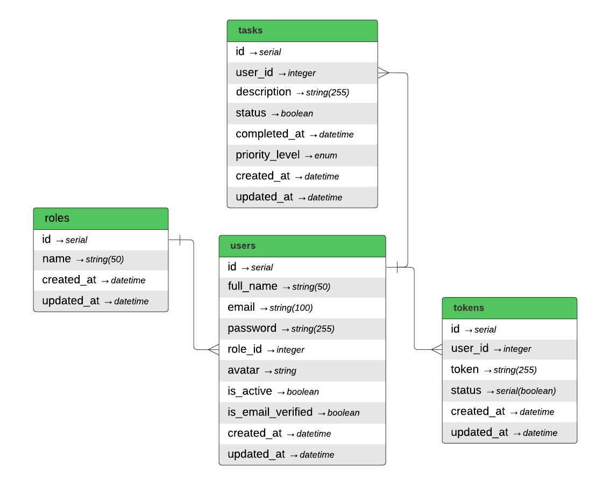

# Todo

## Table of Contents

- [About](##about)
- [Installation](##installation)
- [DB Design](##db)

## About
A learning Todo project to demonstrate FastApi Knowledge and make a basic frontend application with react to manage Tasks

## Installation
- Install docker [Link](https://www.docker.com/products/docker-desktop/)
- Copy `.env.example` into the `.env`
- Goto the project root directory and run this command `docker compose up`
- Open API docs in the browser [Link](http://localhost:8000/docs)
- Open frontend application in the browser [Link](http://localhost:3000)

## DB design
